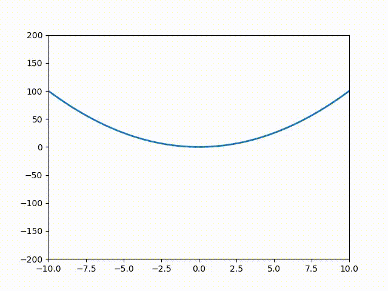
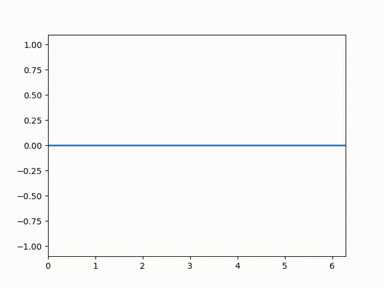
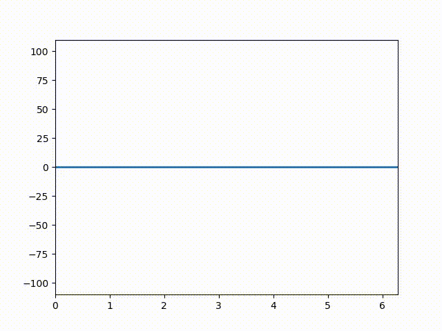
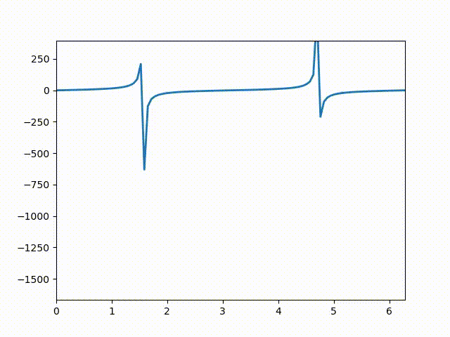

## EasyMatplotlib
Wrapper around the matplotlib API to make animations more similar to matlab or 
at least don't make the innocent data scientist write OPEN_GL kernels just to
animate some data.

## This Version

NGL it's crappy but it works.

check `tests.py` for example animation

## Install

Clone it for now

If it grabs traction then sure

## Preview 

